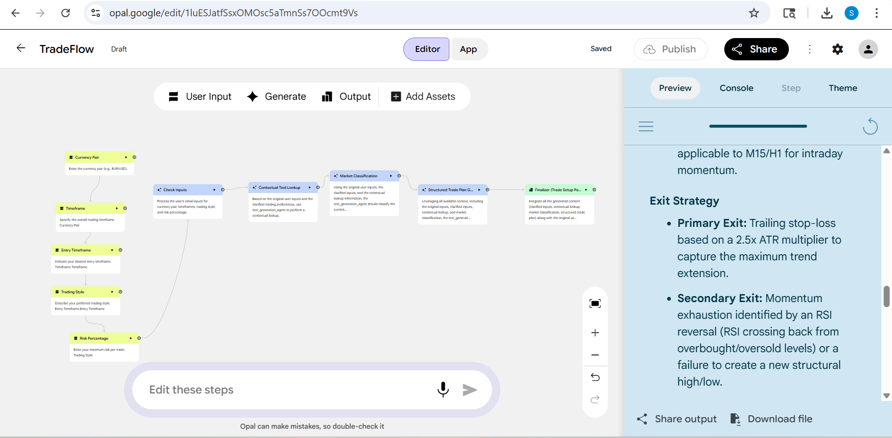

# 🤖 TradeFlow Agent — AI-Powered Trade Setup Automation

> An agentic AI workflow that automates the full trade planning process — from raw user inputs to a complete, structured Trade Setup Package.

---

## 📌 Project Overview

**Course:** ISOM 840 – Security and Privacy | Suffolk University  
**Date:** March 2025  
**Tools:** Google Opal · Agentic Workflow Design · Rule-Based Logic · Google Sheets  
**Live Prototype:** [View on Google Opal](https://opal.google/edit/1luESJatfSsxOMOsc5aTmnSs7OOcmt9Vs)

---

## 🧠 Problem Statement

Traders consistently struggle with producing **consistent, structured, and rule-based trade setups**. The manual process is:

- ⏱️ **Slow** — requires gathering multiple inputs and analyzing market conditions
- 🎲 **Inconsistent** — varies from trade to trade depending on the trader's mood
- 😤 **Emotionally biased** — decisions are influenced by fear or greed
- 📋 **Undocumented** — hard to review, improve, or share

**TradeFlow Agent solves this** by automating the entire trade planning workflow using an AI-powered multi-step pipeline.

---

## ⚙️ How It Works — Agentic Pipeline

The agent takes 5 user inputs and runs them through a 5-stage automated workflow:

```
User Inputs → Check Inputs → Contextual Lookup → Market Classification → Structured Trade Plan → Finalizer
```

| Stage | What It Does | Output |
|---|---|---|
| **User Inputs** | Currency pair, timeframe, entry timeframe, trading style, risk % | Raw inputs stored |
| **Check Inputs** | Validates and cleans all user inputs | Cleaned, validated inputs |
| **Contextual Tool Lookup** | Pulls matching rules from the TradingRules knowledge base | Extracted trading rules |
| **Market Classification** | Classifies current market condition | e.g., Trending + High Volatility |
| **Structured Trade Plan** | Generates full entry, exit, SL/TP, and risk plan | Detailed trade plan |
| **Finalizer** | Assembles everything into one clean package | Complete Trade Setup Package |

---

## 📦 Output — Trade Setup Package

Every run produces a complete, structured Trade Setup Package containing:

- ✅ **Summary** — overview of the trade setup
- ✅ **Clarified Inputs** — cleaned and validated user inputs
- ✅ **Market Classification** — trend/range + volatility condition
- ✅ **Key Levels Table** — support, resistance, dynamic levels
- ✅ **Entry Strategy** — breakout and pullback methods with timeframe guidance
- ✅ **Exit Strategy** — primary and secondary exit conditions
- ✅ **Stop-Loss Logic** — ATR-based volatility buffer + structural buffer
- ✅ **Take-Profit Logic** — 3:1 primary target, 5:1 extended, with scaling plan
- ✅ **Risk Plan / Lot Size** — position sizing based on account equity and ATR
- ✅ **Checklist** — rule-based verification before entering a trade

---

## 📸 Screenshots

### Workflow Overview


> *The multi-step agentic pipeline built in Google Opal — from user inputs to final trade package.*

---

## 💡 Example Trade Setup (Trending + High Volatility)

**Entry:** Wait for a pullback to the 21 EMA with a pin bar or engulfing candle confirmation  
**Stop-Loss:** 2.5x ATR from entry to account for high-volatility noise  
**Take-Profit:** 3:1 R primary target; scale out 50% at 2:1 R, move stop to break-even  
**Position Size:** Reduced by 30–50% due to wider ATR-based stops  

---

## 🗂️ TradingRules Knowledge Base

The agent references a structured **TradingRules Google Sheet** as its contextual knowledge base:

| Condition | Rule | Recommendation | Risk Guideline |
|---|---|---|---|
| Trending | Higher highs + higher lows OR lower highs + lower lows | Trade with the trend; look for pullbacks | Standard risk (1–2%) |
| Ranging | Price bouncing between support & resistance | Trade bounces at range extremes | Smaller position size |
| High Volatility | Large candles, big wicks, wide ATR | Wait for structure before entering | Wider stops, smaller size |
| Low Volatility | Small candles, tight ranges | Be patient; avoid forcing trades | Tight stops, normal size |

---

## 🔑 Key Skills Demonstrated

- **Agentic AI Workflow Design** — multi-step pipeline with distinct roles per node
- **Prompt Engineering** — structured instructions for each agent stage
- **Rule-Based Logic** — contextual lookup from a structured knowledge base
- **Workflow Automation** — end-to-end automation of a complex decision-making process
- **Financial Domain Knowledge** — ATR, EMA, RSI, SL/TP, risk management

---

## 📁 Repository Structure

```
📂 TradeFlow-Agent
├── README.md                     ← You are here
├── TradeFlowAgent.png            ← Workflow screenshot
├── TRADEFLOW_AGENT_REPORT.pdf    ← Full project report
└── TradingRules_Sheet.csv        ← Knowledge base (add your exported sheet here)
```

> 💡 **To add:** Export your TradingRules Google Sheet as a `.csv` and place it in the repo so others can replicate the knowledge base.

---

## 🚀 How to Replicate

1. Open [Google Opal](https://opal.google) and create a new agent
2. Add the following input nodes: `Currency Pair`, `Timeframe`, `Entry Timeframe`, `Trading Style`, `Risk Percentage`
3. Build the pipeline stages: Check Inputs → Contextual Tool Lookup → Market Classification → Structured Trade Plan → Finalizer
4. Connect a Google Sheet as your TradingRules knowledge base
5. Use the prompt structure in the report to configure each stage

---

## 👤 Author

**Solomon Mwangi**  
Suffolk University — ISOM 840  
[LinkedIn](#) · [GitHub](#) · [Portfolio](#)

---

*Built as part of an academic project exploring AI-assisted workflow automation in financial decision-making.*
